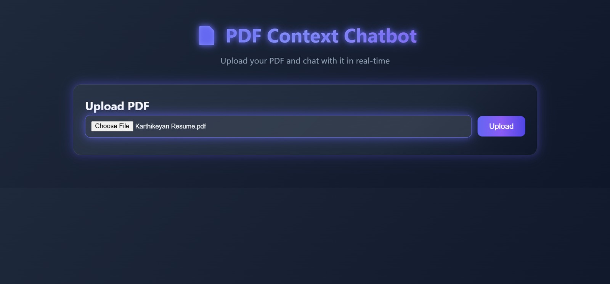
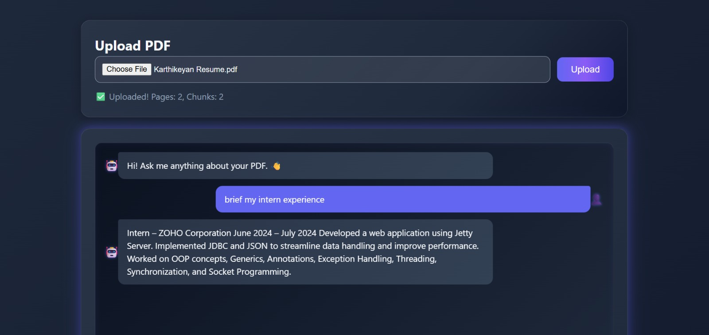
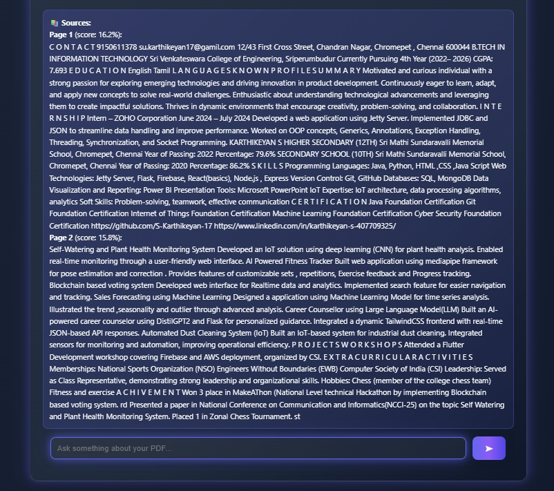

# 📘 AI-Powered PDF Context Retrieval Chatbot (RAG)

An **AI-powered PDF Chatbot** built using **Retrieval-Augmented Generation (RAG)** that allows users to upload PDF documents and interact with them in natural language.  
This project enables contextual question answering from PDF content, making research, learning, and document analysis much easier.

---

## 🚀 Features

- 📂 Upload **one or more PDFs**  
- 🔎 Extracts and processes text from PDFs  
- 🤖 **RAG-powered chatbot** for accurate answers  
- 🎨 **Interactive Frontend** with HTML, CSS, and JavaScript  
- ⚡ Flask backend for handling AI + document processing  
- 📌 Vector-based **semantic search**  
- 📱 Responsive UI for better user experience  

---

## 📂 Project Structure

```bash
rag-pdf-chatbot/
│── app.py                 # Main Flask backend application
│── requirements.txt       # Python dependencies
│── .gitignore             # Files ignored by Git
│── README.md              # Project documentation

├── static/                # Static frontend files
│   ├── index.html         # Main frontend page
│   ├── style.css          # Styling for the UI
│   ├── script.js          # Handles API calls & chat interface

├── templates/             # Flask Jinja2 templates
│   ├── layout.html        # Base template
│   ├── home.html          # Homepage template
│   ├── chat.html          # Chat UI template

├── data/                  # (Optional) Store uploaded PDFs
│   ├── sample.pdf

├── embeddings/            # Vector database (if persisted)
│   ├── index.faiss        # FAISS index for fast retrieval
│   ├── docs.pkl           # Metadata for chunks
⚙️ Tech Stack
🖥️ Frontend
HTML5, CSS3, JavaScript (Vanilla JS)

Responsive UI for desktop & mobile

Dynamic chat window to display Q&A

⚡ Backend
Flask (Python web framework)

Werkzeug for file handling

REST API for communication between frontend & backend

🧠 AI/ML
RAG (Retrieval-Augmented Generation) pipeline:

Text extraction → Extract text from PDF files

Chunking → Split large documents into smaller passages

Embeddings → Convert text chunks into vector embeddings

Vector Store (FAISS / ChromaDB) → Store and retrieve semantically relevant chunks

LLM (Large Language Model) → Generates final answers with context

📚 Libraries Used
flask → Backend web framework

flask-cors → Handle cross-origin requests

PyPDF2 / pdfplumber → Extract text from PDFs

langchain → RAG pipeline, embeddings, retriever

faiss / chromadb → Vector database for semantic search

openai / transformers → LLM integration

🔧 Installation & Setup

1️⃣ Clone Repository
git clone https://github.com/S-Karthikeyan-17/rag-pdf-chatbot.git
cd rag-pdf-chatbot

2️⃣ Create Virtual Environment

python -m venv venv
venv\Scripts\activate   # On Windows
source venv/bin/activate  # On Mac/Linux

3️⃣ Install Dependencies
pip install -r requirements.txt

4️⃣ Run Flask App
python app.py
The app will be running at:
👉 http://127.0.0.1:5000

📸 Screenshots
🔹 Upload PDFs

🔹 Chat Interface

🌟 Future Enhancements
 Support for DOCX, TXT formats

 Add chat history and persistent memory

 Voice-based queries 🎤

 Deploy on Heroku / Render / AWS

 Advanced UI with React

👨‍💻 Author
S. Karthikeyan
🎓 B.Tech Information Technology (2022–2026)

App will run at 👉 http://127.0.0.1:5000

## 📸 Output Screenshots






